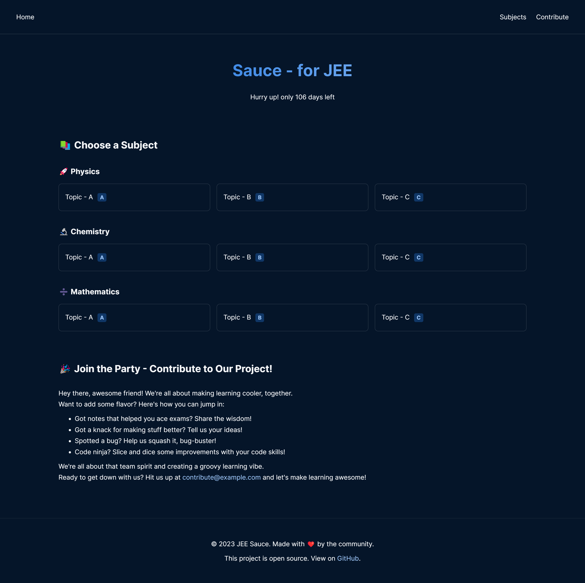
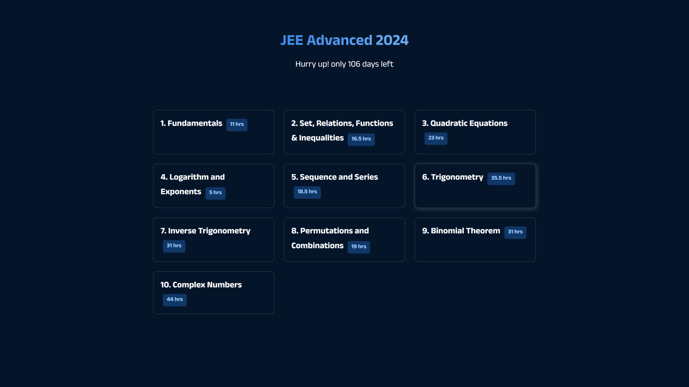

# Changelog - Sauce - for JEE

## Version: 2.0.0

- Redesigned website layout for improved visual appeal.
- Added responsive navigation bar for easy navigation.
- Introduced "Explore" section for topic selection.
- Enhanced "Contribute" section with engaging content.
- Improved organization of CSS files for maintainability.
- Integrated Font Awesome icons for navigation elements.
- Added footer with GitHub repository link.

This update brings a fresh look and enhanced usability to Sauce - for JEE.

## Version: 1.0.0 (Initial Release)

- Created the base structure of the website with HTML and CSS.
- Added a countdown timer to track the upcoming JEE Advanced 2024 exam.
- Included resource links for JEE preparation in the "Resources" section.
- Designed a responsive layout for mobile and desktop screens.
- Styled the website with a casual and inviting vibe.
- Set up a favicon for the website's tab.
- Organized the code into separate HTML, CSS, and JS files.

This marks the first version of Sauce - for JEE, aimed at providing a starting point for JEE aspirants to access valuable resources and stay updated about the upcoming exam. Stay tuned for more features and improvements in the future!
