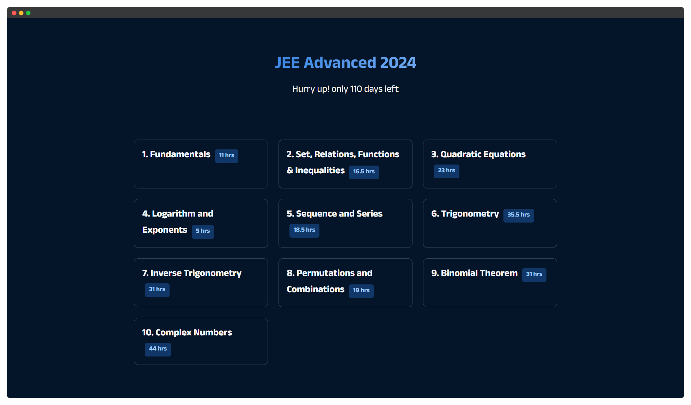

# Sauce - for JEE

This repository contains a web page for JEE 2024 countdown and study resources. It's designed to display the countdown timer and provide study resources for various topics.

## Preview

## Getting Started

1. Clone this repository to your local machine.
2. Open the `index.html` file in your web browser to view the countdown and study resources.

## Features

- Countdown timer for JEE Advanced 2024.
- Study resources for various topics.
- Responsive design for different screen sizes.

## Study Resources

Check out the study resources provided in the web page:

1. [Fundamentals](https://youtube.com/playlist?list=PL2dPD7oDhSn_AWsHY_tfVk0v5L0FPKj6i) - 11 hrs
2. [Set, Relations, Functions & Inequalities](https://www.youtube.com/playlist?list=PL2dPD7oDhSn8ccydX5qV7SWHz4HwYiEKi) - 16.5 hrs
3. [Quadratic Equations](https://youtube.com/playlist?list=PL2dPD7oDhSn9ckRZr8_tTEiD16NgQxujr) - 23 hrs
4. [Logarithm and Exponents](https://www.youtube.com/playlist?list=PL2dPD7oDhSn9LvrGnl7JfM35ELKPvBsEf) - 5 hrs
5. [Sequence and Series](https://youtube.com/playlist?list=PL2dPD7oDhSn9G-UrS7bmMqFWa228_C3TS) - 18.5 hrs
6. [Trigonometry](https://youtube.com/playlist?list=PL2dPD7oDhSn--VE2gHl0lNWDdh_AgMA9b) - 35.5 hrs
7. [Inverse Trigonometry](https://youtube.com/playlist?list=PL2dPD7oDhSn_RuxShJx-WbwfKKdLGzjLr) - 31 hrs
8. [Permutations and Combinations](https://www.youtube.com/playlist?list=PL2dPD7oDhSn9h3NIkfgKYUayvA4lNyLkY) - 19 hrs
9. [Binomial Theorem](https://youtube.com/playlist?list=PL2dPD7oDhSn94ONH81bb-Zkt7TYHOR-Vi) - 31 hrs
10. [Complex Numbers](https://youtube.com/playlist?list=PL2dPD7oDhSn8YdI6ImeGBfbXDZMvsQ5YZ) - 44 hrs

## Contributors

- [ishaang-dev](https://github.com/ishaang-dev)

Feel free to contribute and add more study resources!

---
*This project is created for educational purposes.*
