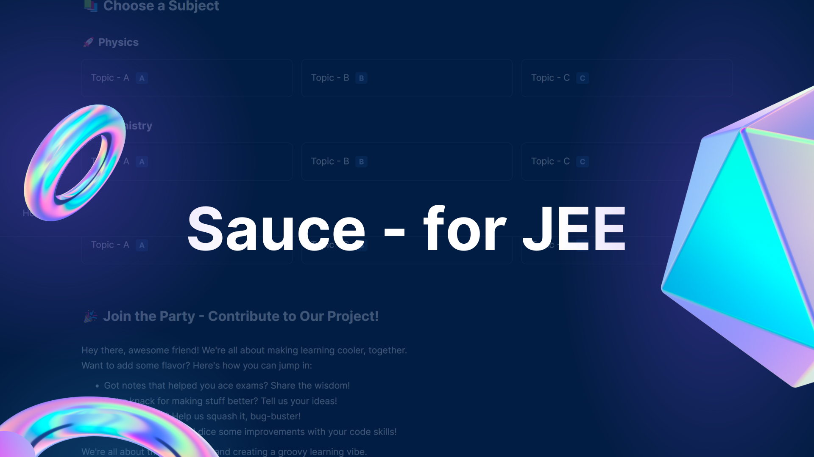

# Sauce - for JEE 🚀

Hey there, fellow JEE aspirant! 🌟 If you're on a journey to conquer the IIT-JEE, you're in for a treat. **Sauce - for JEE** is your go-to hub for a carefully curated collection of JEE resources that are here to assist, not overwhelm!

## What's Inside? 📚

Think of Sauce - for JEE as your treasure chest of study materials and tools to enhance your JEE preparation. It's not about reinventing the wheel but rather about steering you in the right direction. Keep your resources simple, focused, and effective.

## The Recipe for Success 📋

Here's how we're making your JEE prep experience exceptional:

- **Resource Collection**: We've handpicked a range of resources that cover the JEE essentials. Consider this your one-stop shop for quality materials.

- **Online Learning Power**: Embrace the beauty of online learning, just like we did! Online coaching is a game-changer, and we're all about harnessing its potential.

- **Minimalistic Magic**: We're advocates of the less-is-more philosophy. No need for information overload. We encourage you to keep your resource pool lean and effective.

## Ready to Dive In? 🍔

### Resources at Your Fingertips

Visit our [Sauce - for JEE website](https://ishaang-dev.github.io/resources-jee/) to explore a curated collection of resources that can help you on your JEE journey. From concept refreshers to practice problems, it's all here, waiting for you!

### Embrace Online Learning

While we're all about curated resources, we also believe in the power of online coaching. Explore reputable online platforms to complement your preparation and make the most of your time.

### Keep It Simple, Ace It Big

Remember, quality beats quantity. It's not about how many resources you have; it's about how well you use them. Craft a study plan that resonates with your style and pace.

## Let's Contribute! 🌶️

Have a gem of a resource to share? We welcome contributions that align with our philosophy. Let's keep it focused, helpful, and impactful. Share your suggestions and let's make the JEE prep journey smoother for everyone! Read our [Contribution Guidelines](CONTRIBUTING.md) for more details.

## Your Success, Your Way 🎩

This project is all about sharing knowledge and supporting each other. Feel free to explore the resources and use them to pave your path to JEE success. Remember, you're in control of your journey!

Hungry for more details? Reach out to us anytime on [Telegram](https://t.me/sauceforjee).

So, are you ready to rock your JEE prep with the power of minimalistic, quality resources? Let's dive in and make your journey a memorable one! 🥄🎓🔥
